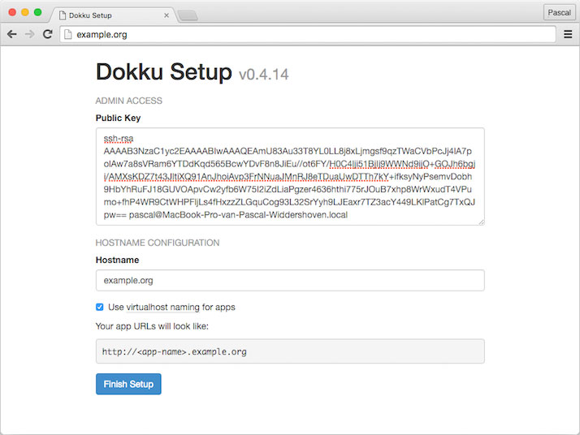

# Deploy a Spring Boot app on your own server in less than 15 minutes

Hosted PaaS (Platform As A Service) offerings like [Heroku](https://heroku.com) and [OpenShift](https://www.openshift.com/) are great but not always suitable or even possible to use. If you need or want full control over your data and servers, or you just want to host your latest side project but don’t want [Heroku dyno sleeping](https://devcenter.heroku.com/articles/dyno-sleeping) you might just want to self host.

Traditionally self-hosting was painful and cumbersome but today there are plenty options to self-host your apps that are nearly as painless as a hosted PaaS solution. In this tutorial I will show you how to deploy an app on [Dokku](https://github.com/dokku/dokku):

> Dokku is an extensible, open source Platform as a Service that runs on a single server of your choice.

Dokku provides an environment very similar to Heroku technically, allowing Dokku to take advantage of [Heroku buildpacks](https://devcenter.heroku.com/articles/buildpacks) to deploy your apps. Dokku uses these buildpacks to automatically build [Docker](https://www.docker.com/) containers that can run your apps and services. Refer to the [Dokku documentation](http://dokku.viewdocs.io/dokku/installation/) for more information on Dokku.

For this tutorial we’ll be using [this](https://github.com/kabisa/dokku-boot-demo) Spring Boot example app I’ve set up. It's a very basic app with a single HTTP endpoint that serves up a semi-random quote retrieved from a Postgres database. It’s a completely vanilla Spring Boot app, except for a single file to instruct Dokku how to start the app but more on that later. Let’s get started!

## 1. Get a (virtual) server

Get a server with root access. Dokku requires at least 1GB of RAM and officially only supports Ubuntu 14.04 x64.

For convenience you'll want to assign a DNS hostname (`dokku.example.org`) to your servers IP and preferably even assign a wildcard record so you can deploy apps on `<app name>.dokku.example.org`.

## 2. Install Dokku

SSH into your server and execute the following command to kick off the Dokku installation. Run this either as root or make sure your user account has sudo permissions.

```
wget -qO- https://raw.githubusercontent.com/dokku/dokku/v0.4.14/bootstrap.sh | bash
```

Sit back, get some coffee, this will take a couple of minutes. When the command completes open your browser and navigate to the ip address or hostname assigned to your server to complete the Dokku setup.



Provide your SSH public key here so you’ll be able to push your app to Dokku later via Git.
Enable `use virtualhost naming for apps` and enter the hostname you assigned to your server in step 1.

That's it, you now have a fully functional Dokku instance up and running! Let’s see what it takes to actually deploy an app.

## 3. Prepare your app for deployment on Dokku

We're about ready to deploy our first app. In general if you want to deploy an app on Dokku you don't need to make a lot of modifications to your app. Especially if your app adheres to the [Twelve Factor](http://12factor.net/) guidelines you should be fine. Most importantly your app should allow configuration via environment variables or command line parameters.

Fortunately Spring Boot embraces the Twelve Factor guidelines. Spring Boot supports configuration via environment variables out of the box and it's trivial to implement your own.

Looking at the [example app](https://github.com/kabisa/dokku-boot-demo) I prepared there are two important things to notice:

&nbsp;1. I've created two property aliases to allow configuration via `$PORT` and `$DATABASE_URL`. This is not strictly necessary but I prefer the more generic environment variables over the Spring specific ones.

```java
// application.properties
spring.datasource.url=${database.url:jdbc:postgresql://localhost:5432/dokku-demo}
server.port=${port:8080}
```

&nbsp;2. I've added a Procfile to instruct Dokku how to start our app. Dokku will read this file during deployment and use the `web` process to boot our app. You can read more about Procfiles [here](https://devcenter.heroku.com/articles/procfile).

```sh
# Procfile
web: env DATABASE_URL=$JDBC_DATABASE_URL target/dokku-boot-demo-0.0.1-SNAPSHOT.jar
```

During deployment Dokku invokes `mvn install` on our app so it will build a jar. Here we instruct Dokku that to launch our app it needs to execute the jar. We set the `$DATABASE_URL` to `$JDBC_DATABASE_URL` which is an environment variable provided by the Java buildpack that formats the database connection string for JDBC compatibility.

## 4. Deploy your app

Alright so now our app is Dokku compatible. Before we can push our app to Dokku we need to configure our application in Dokku. For simplicity enter the following `dokku` commands in an SSH session on your server. Later you can setup the [Dokku CLI client](http://dokku.viewdocs.io/dokku/community/clients/) to run these commands directly from your local machine.

First we'll create our app in Dokku:

```sh
$ dokku apps:create my-app
```

Next we'll install the Dokku Postgres plugin:

```sh
$ dokku plugin:install https://github.com/dokku/dokku-postgres.git postgres
```

This will pull in a Postgres Docker image so give it some time to complete.

Next create a Postgres instance for our app:

```sh
$ dokku postgres:create my-app-postgres
```

Link it to our app:

```sh
$ dokku postgres:link my-app-postgres my-app
```

That's all the configuration we need, let's actually deploy our app now!

First clone the example app to your local machine:

```sh
$ git clone https://github.com/kabisa/dokku-boot-demo.git
$ cd dokku-boot-demo
```

Dokku uses a Heroku-style `git push to deploy` model, so we'll need to add a Git remote to our repo to point to Dokku's Git repo. Replace `dokku.example.org` with your actual Dokku hostname.

```sh
$ git remote add dokku dokku@dokku.example.org:my-app
```

And finally push our app to Dokku:

```sh
$ git push dokku
```

Dokku will now detect our app is a Java app, download the Heroku Java buildpack, compile the app and run it.

You should see similar output as below:


Open your browser at `http://my-app.dokku.example.org/` and see a nice random quote!

## Closing thoughts

Dokku takes a bit of one time setup but once you have your Dokku instance ready, deploying new applications will be a breeze. Do note that Dokku was designed for simple single server setups. If you need fancy stuff like clustering, access control etc you might want to look at one of the more comprehensive projects in this space like [Flynn](https://flynn.io), [Deis](http://deis.io) or [Cloud Foundry](http://docs.cloudfoundry.org/).

Even though Dokku is quite simple, we've only scratched the surface of what it can do. You now have a fully functional Dokku instance so go ahead and explore the [Dokku docs](http://dokku.viewdocs.io/dokku/installation/) to see what more is possible!

If there's no suitable Heroku buildpack for your app you can always deploy a raw Docker container using Dokku by simply including a `Dockerfile` in the root of your project.

If you're planning to deploy a more complex Spring Boot app to Dokku you might want to look into [Spring Cloud Connectors](http://cloud.spring.io/spring-cloud-connectors/). Spring Cloud Connectors can automatically detect that you're running in a cloud platform, and configure your HTTP port and database automatically for you. Spring Cloud Connectors officially don't support Dokku, but the Heroku support works just fine with Dokku.

Also be sure to check out [the plugins](http://dokku.viewdocs.io/dokku/plugins/) that Dokku offers to make use of databases, message brokers etc. There's even a [Dokku Let's Encrypt](https://github.com/dokku/dokku-letsencrypt) plugin for dead easy [Let's Encrypt](https://letsencrypt.org) SSL certificates.

Happy deploying!
